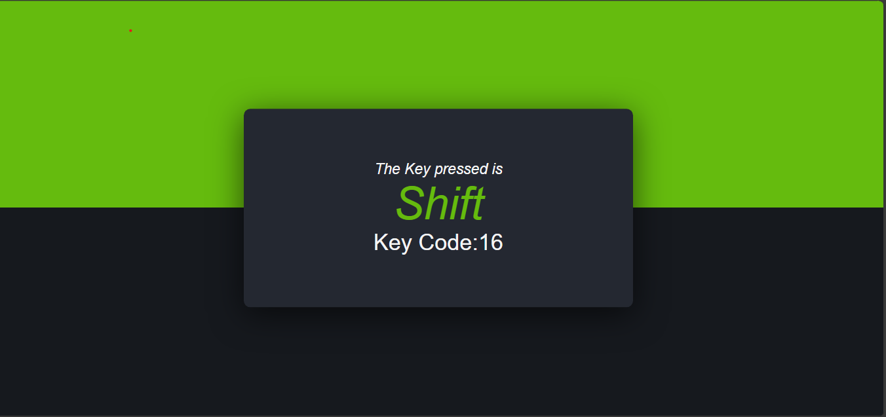

🎹 KeyPress Detector

A simple interactive web application built with **HTML, CSS, and JavaScript** that detects and displays the key pressed by the user in real time.


 📸 Screenshot


 🚀 Features
- Detects any key pressed on the keyboard
- Displays both the **key character** and its **key code**
- Responsive and clean UI with gradient background
- Highlighted pressed key for better readability
- Beginner-friendly JavaScript event handling example

🛠️ Tech Stack
- HTML – Structure of the web page  
- CSS – Styling and layout (gradient background, responsive box)  
- JavaScript – Handles key press events dynamically  

📂 Project Setup
Clone this repository and open the project in your browser:


Navigate to the project folder
cd KeyPress-Detector

Open index.html in your browser

💡Use Cases

-> Learn JavaScript event handling (keydown event)
-> Useful for checking which key codes are generated by different keyboard inputs
-> Can be extended into typing games, custom hotkey setups, or shortcut managers

🤝 Contributing
Contributions, issues, and feature requests are welcome!
Feel free to fork this project and submit a pull request.

📜 License
This project is licensed under the MIT License – see the LICENSE
 file for details.

 Clone the repository
 git clone
```bash
 https://github.com/umarazlan/KeyPress-Detector-using-html-css-and-javascript.git 

